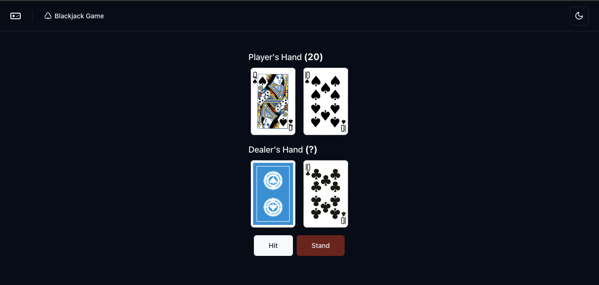

## Blackjack Game

This project implements the classic card game of Blackjack (also known as 21 or Pontoon). 

**How to play**

1. The game is played against the dealer.
2. The player's goal is to get a hand value as close to 21 as possible without going over.
3. The player can request additional cards by clicking on the button 'Hit' or keep the current hand by clicking on the button 'Stand'.
5. The player wins if the hand value is higher than the dealer's hand value without going over 21.
6. The player loses if the hand value goes over 21 or the dealer's hand value is higher.
7. The player can also win if the dealer's hand value goes over 21.
8. At the end of the game, a toaster message will be displayed 'You Won' if the player wins, 'You Lost' if the dealer wins, or 'Tie' if the game ends in a draw.

**Getting Started**

1. **Clone the repository:**
   ```bash
   git clone https://github.com/hugomarcelosilva/blackjack.git
   ```

2. **Install dependencies:**
  * Make sure you have pnpm installed. If not, please refer to their installation instructions: https://pnpm.io/installation
  * Once pnpm is ready, run the following command:
   ```bash
   pnpm install 
   # Or, if you prefer npm:
   npm install
   ```

**Running the Development Server**

```bash
pnpm dev
# Or
npm run dev
```
This will start a development server, usually on http://localhost:5173/

**Running Tests**

```bash
pnpm test
# Or
npm test
```

**Running Test Coverage**

```bash
pnpm test:coverage
# Or
npm test:coverage
```

**Running E2E Tests**

```bash
pnpm playwright test
# Or
npm run playwright test
```

**Code Linting**

```bash
pnpm lint
# Or 
npm run lint
```

**Project Structure**

* `src`
   * `components`: Contains the React components for the game.
   * `lib`: Holds utility functions.
   * `pages`: Holds the layout, game, 404 and error pages. 
   * `utils`: Holds the game logic.
* `public`: Contains static assets for the cards.
* `tests`: Contains the e2e test files.

**License**

This project is licensed under the MIT License. See the [LICENSE](LICENSE) for details.